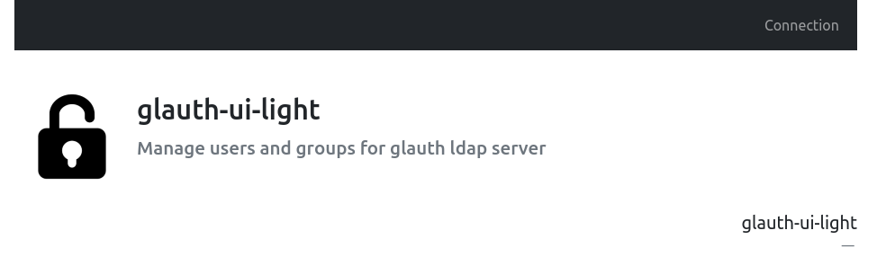
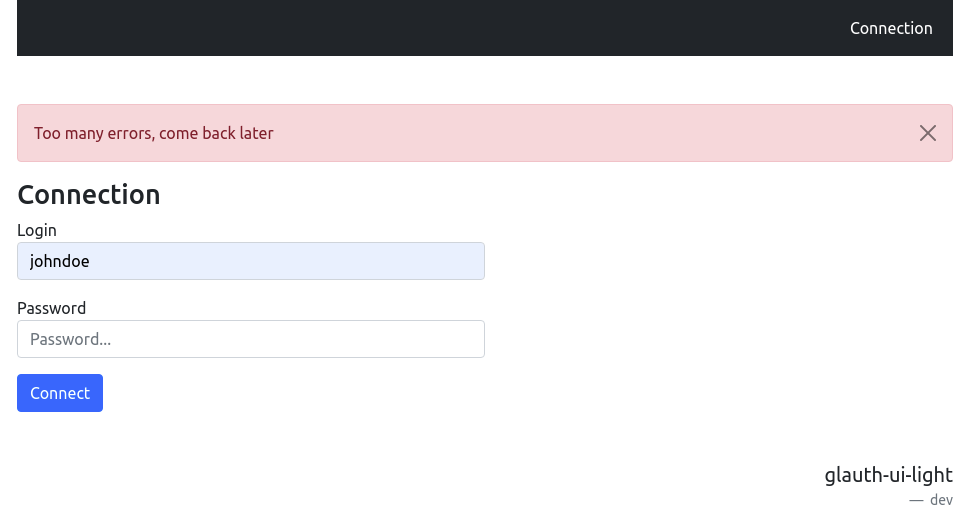
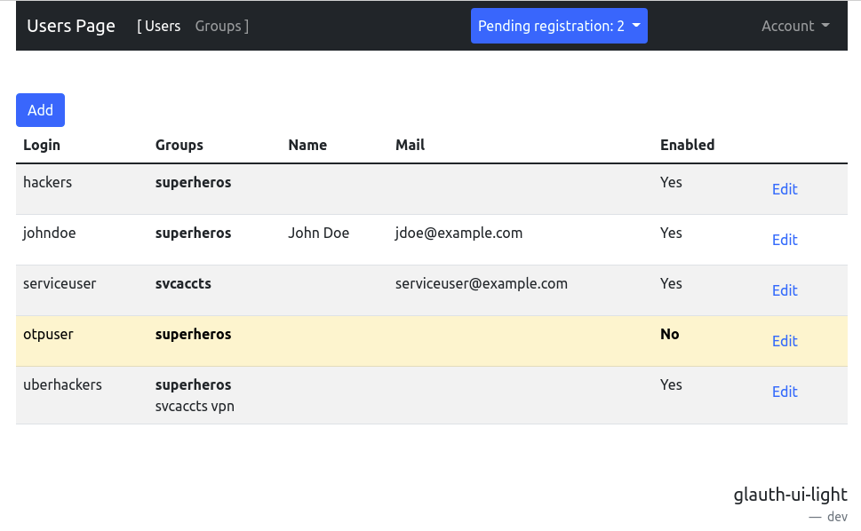
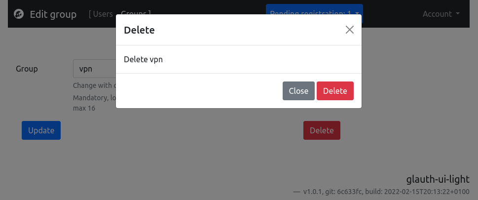
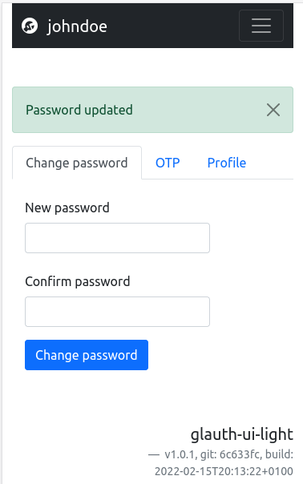

# glauth-ui-light

## Description

**glauth-ui-light** is a small golang web app to manage users and groups from the db files of [glauth ldap server](https://github.com/glauth/glauth) for small business, self hosted, labs infrastructure  or raspbery servers.

[](https://coveralls.io/github/yvesago/glauth-ui-light?branch=main)

Thanks of hot-reload feature on glauth configuration file change, **glauth-ui-light** can edit and update glauth configuration and manage ldap users.

**glauth-ui-light** update only users and groups. 

All lines after the first ``[[users]]`` in  glauth configuration file will be updated. The use of same model structure than glauth V2 allow to keep manual edition of non managed features as ``capabilities, loginShell, sshkeys, otpsecret, yubikey, includegroups, ...``. Only comments on these lines are lost.

Current glauth experimental feature on ``customattributes`` is lost due to the need of a patched ``toml`` library.


## Main aims

- Static binary with small customisations
- Keep abbility to edit glauth configuration file
- Minimal javascript use


## Current features

- Custom front page text and application name
- Add new localisations by adding new yaml file
- Authentication with current glauth users if ``allowreadssha256`` is set
- Admin right is defined for members of group defined in ``gidadmin``
- Users in group ``gidcanchgpass`` are common users and can change their passwords 


## Missing glauth V2 features

Current glauth experimental feature on ``customattributes`` is lost due to the need of a patched toml library.


## Some overkill features for a self hosted infrastrucuture

- only register bcrypt passwords
- daily log rotates
- i18n support
- responsive UI
- delayed after 4 failed login
- rate requests limiter against brute force ttempts
- CSRF
- STS, CSP
- standalone SSL or via reverse proxy
- high tests coverage
- windows, macos builds (not tested)


## Limits

Allow users to self change their passwords can create bad concurrent updates of glauth configuration file.

## Install binary

**Download** last release from https://github.com/yvesago/glauth-ui-light/releases


**Create config file :**
```
#######################
# glauth-ui-light.conf

# dbfile: glauth conf file 
#    with watchconfig enabled for hot-reload on conf file change
#    glauth-ui-light need write access
dbfile = "samples-conf/glauth-sample-simple.cfg"

# run on a non privileged port
port = "0.0.0.0:8080"
# When a self hosted ssl reverse proxy is used :
#  port = "127.0.0.1:8080"

# Custom first page texts
appname = "glauth-ui-light"
appdesc = "Manage users and groups for glauth ldap server"

[sec]
  # TODO set random secrets for CSRF token
  csrfrandom = "secret1"

[passpolicy]
  min = 2
  max = 24
  allowreadssha256 = true  # to be set to false when all passwords are bcrypt

[cfgusers]
  start = 5000           # start with this uid number 
  gidadmin = 5501        # members of this group are admins
  gidcanchgpass = 5500   # members of this group can change their password

[cfggroups]
  start = 5500   # start with this gid number 
```


**Start :**
```
$ ./glauth-ui -c glauth-ui-light.conf &

$ firefox http://localhost:8080/

```

## Install Debian package

Download last deb file from https://github.com/yvesago/glauth-ui-light/releases

```
$ sudo dpkg -i glauth-ui-light_1.0.0-0~static0_amd64.deb

$ systemctl status glauth-ui-light
● glauth-ui-light.service - Glauth web
   Loaded: loaded (/lib/systemd/system/glauth-ui-light.service; enabled; vendor preset: enabled)
   Active: active (running) since Tue 2022-02-08 18:07:00 CET; 1s ago
 Main PID: 8110 (glauth-ui-light)
    Tasks: 5 (limit: 4915)
   CGroup: /system.slice/glauth-ui-light.service
           └─8110 /usr/bin/glauth-ui-light -c /etc/glauth-ui/glauth-ui.cfg

# custom config
$ vi /etc/glauth-ui/glauth-ui.cfg

# logs
$ tail -f /var/log/glauth-ui/app.20220208

```

## Usage

**Home**


**Login**


**Change password**


**Manage users**


**Delete group**


**Responsive**




## Localisation
``cp locales/tr.yml locales/it-IT/it.yml``

Translate strings and add new local to config file

```
...
[locale]
  lang = "it"
  path = "locales/"
  langs = ["en-US","fr-FR","it-IT"]
...

```


## Build binary

```
$ git clone https://github.com/yvesago/glauth-ui-light.git

$ cd glauth-ui-light

$ make
```

Tests:
```
# linter
$ golangci-lint run ./...                                                                                    

# tests
$ go test ./...
?   	glauth-ui-light	[no test files]
ok  	glauth-ui-light/config	  0.284s
ok  	glauth-ui-light/handlers  0.246s
ok  	glauth-ui-light/helpers	  18.048s # failed login tests need 18s
ok  	glauth-ui-light/routes	  0.019s


# test coverage
$  go test -coverprofile=coverage.out ./... 

$ go tool cover -func=coverage.out
...
glauth-ui-light/routes/routes.go:78:	initServer		85.4%
glauth-ui-light/routes/routes.go:174:	SetRoutes		93.5%
glauth-ui-light/routes/routes.go:220:	contains		100.0%
glauth-ui-light/routes/routes.go:229:	setCacheHeaders		100.0%
glauth-ui-light/routes/routes.go:248:	Auth			100.0%
total:					(statements)		93.7%

# html browser output
$ go tool cover -html=coverage.out
```

## Deploy

```
$ scp -pr locales admin@server:/home/app/glauth-ui-light

$ scp build/linux/glauth-ui  admin@server:/home/app/glauth-ui-light
```

## Build debian/ubuntu package

```
$ apt install build-essential quilt

$ git clone https://github.com/yvesago/glauth-ui-light.git
$ cd glauth-ui-light

$ debuild -us -uc -b

# view content
$ dpkg-deb -c ../glauth-ui-light_1.0.0-0~static0_amd64.deb

# install
$ sudo dpkg -i ../glauth-ui-light_1.0.0-0~static0_amd64.deb
```

### Code structure:
```
main.go
|-config
    |-glauth-config-v2.go   // glauth users goups models
    |-webconfig.go
    |-user.go     // user methods   
|-helpers
    |-cookie.go   // cookies for session
    |-db.go       // read write data
    |-18n.go      // i18n
    |-sessions.go // manage session
|-handler
    |-global.go   // global var, render
    |-login.go
    |-users.go
    |-groups.go
|- routes
    |-routes.go   // load template, i18n. Set routes, auth middleware
    |-web         // due to "embed" files 
       |-assets
          |-css
             |-bootstrap.css
             |-....css
          |-js
             |-....js
          |-templates
             |-global
                |-header.tmpl
                |-footer.tmpl
             |-home
                |-index.tmpl
                |-login.tmpl
             |-user
                |-list.tmpl
                |-add.tmpl
                |-edit.tmpl
                |-profile.tmpl
             |-group
                |-list.tmpl
                |-add.tmpl
                |-edit.tmpl
|-locales
    |-en-US
    |-fr-FR
|-samples-conf
    |-webconfig.cfg
    |-glauthconfig.cfg

```


## References
 
https://github.com/demo-apps/go-gin-app

https://etienner.github.io/connexion-deconnexion-avec-gin/

https://www.alexedwards.net/blog/form-validation-and-processing

https://vincent.bernat.ch/en/blog/2019-pragmatic-debian-packaging


## Changelog

v1.0.0:
  * initial release


## TODO

* Add otp


## Licence

MIT License

Copyright (c) 2022 Yves Agostini

<yves+github@yvesago.net>


